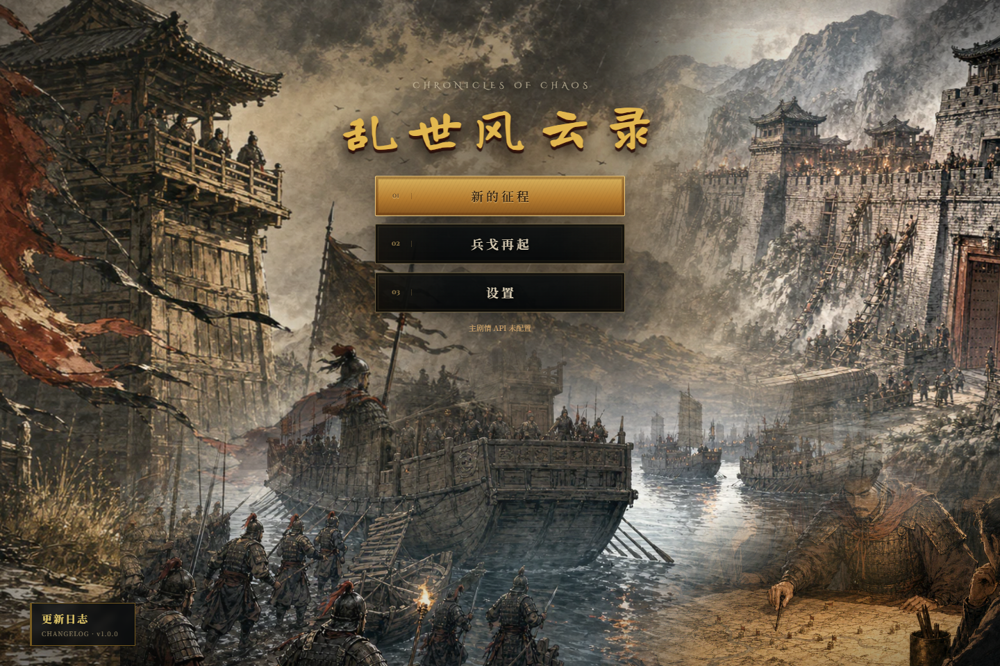
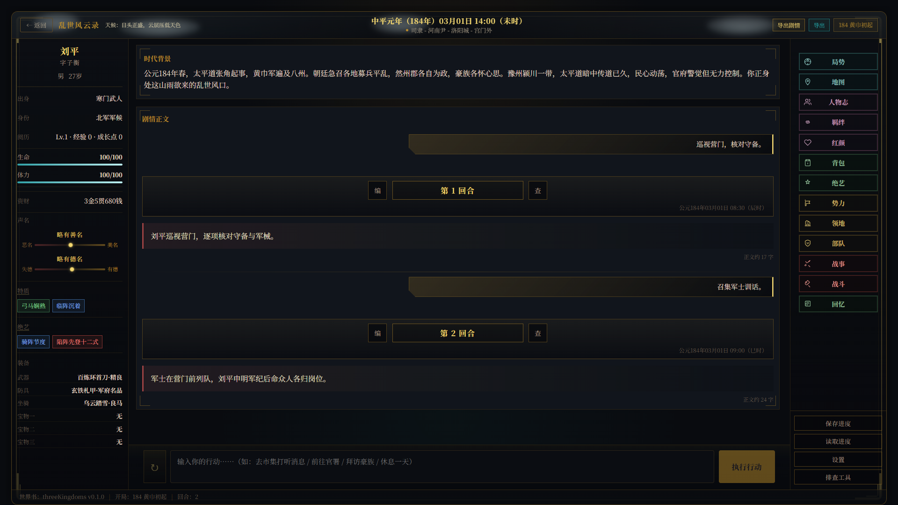
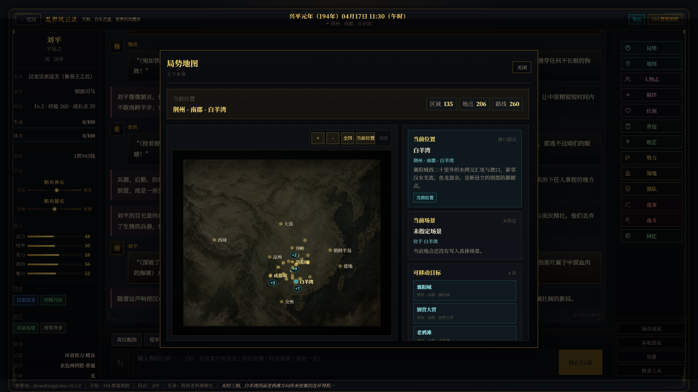
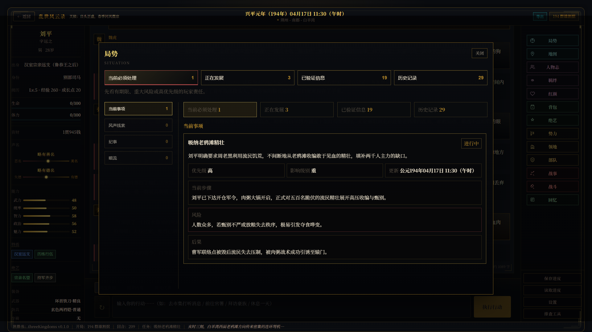

<div align="center">

# 乱世风云录

### Chronicles of Chaos

一款由大语言模型驱动、让人物与天下局势在本地结构化状态中持续演化的三国乱世互动叙事 RPG。

[English](README.en.md) · **v1.0.0** · 简体中文首发版

</div>



## 走进一段不会重置的乱世人生

你可以自创一名无名之辈，也可以扮演史实人物，从不同年代、地域、身份与处境进入东汉末年至三国时代。历史提供世界的骨架，但不会替玩家决定故事：同一场乱世可以成为游侠的漂泊、县吏的抉择、诸侯幕府的权谋，也可以成为一支部曲、一座城池或一个家族逐渐改变天下的过程。

项目不使用固定任务树把剧情锁死。LLM 负责理解行动、叙事和推演；本地运行时负责保存事实、校验结构化写回、管理人物记忆，并让后续回合真正承接已经发生的选择与代价。

## 核心体验

- **自创角色与史实人物开局**：世界包、年代书签、出身、身份、地点和玩家要求共同决定开局；史实人物档案可以在当前世界线基础上补全。
- **持续世界，而非单回合聊天**：人物、地点、物品、金钱、任务、关系、势力、领地、部队和历史局势通过结构化写回进入存档，正文不能绕过事实层悄悄改写世界。
- **会记住、会远行的 NPC**：人物拥有档案、近期记忆、压缩后的中长期记忆与关系状态；重要 NPC 即使不在玩家眼前，也可以依据自身处境继续行动。
- **势力、领地与部队演化**：势力行动、辖境治理、资源、军需、部队位置与远场情报随游戏时间变化，并与玩家已经建立的世界线相互影响。
- **规则落地的战斗与战争**：本地系统先完成判定和确定性结算，再由主模型把结果写成叙事；伤势、减员、战果、领地和后果继续进入长期状态。
- **三国世界包与 1500 条 StoryPack 素材**：跨身份、时代和地域的通用剧情素材结合史实知识与当前存档选择，不强迫故事机械重演历史。
- **面向长存档的本地数据链**：IndexedDB 保存手动/自动存档、回合历史和大型状态；支持存档导入导出、剧情导出、重 ROLL 与回合回溯。
- **可拆分的模型路由**：主剧情、独立写回、记忆压缩、向量嵌入、NPC 模拟、人物补全、世界演化和图片提示词可以分别选择 API 档案与模型。
- **桌面与移动端界面**：局势、地图、人物志、羁绊、红颜、背包、绝艺、势力、领地、部队、战事、战斗与回忆等面板会随设备尺寸重排。

## 游戏界面



| 天下地图 | 动态局势 |
| --- | --- |
|  |  |

地图、局势与各类档案面板都是同一份长期事实状态的不同投影，不是脱离正文独立运行的第二套游戏。

## 本地运行

准备当前 Node.js LTS 与 npm，然后执行：

```powershell
npm ci
npm run dev
```

Vite 会输出本地访问地址。首次进入后，按首页引导：

1. 保存主剧情 API 档案并分配主叙事模型；
2. 按需配置独立写回、记忆压缩、向量嵌入、NPC 模拟、人物补全与世界演化；
3. 选择三国世界包、年代、开局方式和角色；
4. 开始新档，或从本地 ZIP 导入既有存档。

项目内置 OpenAI、DeepSeek、Gemini、Anthropic Claude、Qwen、智谱 GLM、Moonshot/Kimi、豆包、xAI、Groq、Mistral、Ollama、LM Studio、OpenAI-compatible 与自定义接口配置入口。实际模型可用性、计费、内容政策与数据处理方式由玩家选择的第三方服务决定。

### 构建与验证

```powershell
npm run lint
npm test
npm run test:e2e
npm run build
```

默认测试不会调用真实付费 API。

## 本地数据、API 与隐私

- API 档案、密钥、存档、剧情和运行状态默认保存在玩家自己的浏览器或设备中。
- 模型请求由浏览器直接发送给玩家自行选择的第三方服务，不经过开发者运营的 AI 中转服务器。
- 导出的 API 设置文件可能包含明文密钥；请只用于本机迁移或私有备份，禁止提交到 Git 或公开分享。
- 可选的 Cloudflare Pages Functions + D1 运营统计只收集有限的匿名运行指标，例如在线人数、会话、语言、设备类别、版本与粗粒度 IP 归属地区。
- 统计端不保存原始 IP，也不采集玩家输入、剧情、存档、人物关系、API 配置、密钥、提示词、模型名或请求响应正文。
- 本地开发默认不发送运营统计；只有生产构建或明确启用后才会上报匿名心跳。

## 内容说明

本项目使用公开历史、地理、制度与人物资料构建时代背景。除预置资料外，动态事件、人物言行、关系与剧情由玩家行为、当前存档及玩家自行选择的第三方人工智能服务即时生成。

生成内容只属于相应本地存档中的虚构世界线，不代表任何现实或历史人物的真实经历、言行、立场或品格。本游戏与其中提及的人物、机构、企业或其他权利人不存在授权、赞助、认可或合作关系。

资料纠错或权利通知：**kale014@gmail.com**

## 许可证

© 2026 RedCliffScribe。

- **程序代码**：依照 [`AGPL-3.0-only`](LICENSE) 开源。允许使用、修改和商业运行；分发修改版本或通过网络向用户提供修改版本时，必须依照许可证提供对应源码。
- **原创内容资产**：RedCliffScribe 有权授权的原创美术、演示图片、StoryPack/WorldPack 叙事内容及其他非代码作品，依照 [`CC BY-NC-SA 4.0`](LICENSE-ASSETS.md) 提供。必须署名，禁止商业使用，公开改编版本时必须采用相同许可。

因此，代码本身属于开源软件，但包含上述内容资产的完整游戏不得在未经另行许可的情况下用于商业目的。许可证只覆盖 RedCliffScribe 拥有或有权授权的部分；第三方名称、商标、公开事实及其他非自有权利不因此获得授权。商业授权咨询：**kale014@gmail.com**。
